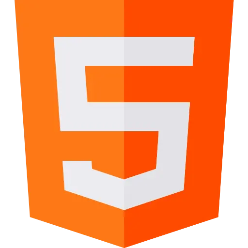
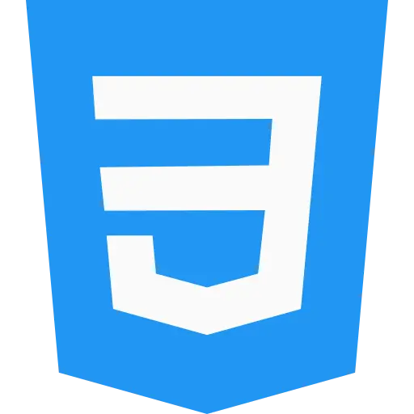
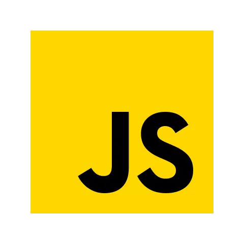
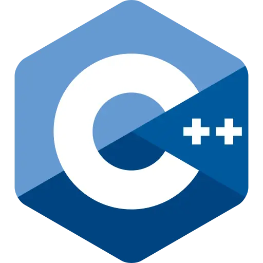

<h1><em>Greetings!</em></h1>

<a href="./README-BR.md">
    </img>
</a>

<h2> 
    <a href="https://matt-macarte.github.io/My-Website/">Matheus AC</a> 
</h2>

</img>

*He/him*

Hi! I'm an aspiring **computer scientist** who never stops *searching for knowledge*.

I have a few hobbies, such as *cocktailing*, *baking*, *coffee* and *electronics*. My passion is to <em style="color:#FFD60A;">create</em>.

> *If the idea is fun, you can count me in!*

---

Currently working on **too many** projects (and not close to finishing any 😅).

Daily learning **font-end** webdev (HTML, CSS, JS) and **C++**.

    
    
    
    
    

<em>(and neovim...)</em>

Feel free to e-mail me anytime!

---

> *"It's not hard, it's just **new**"*
